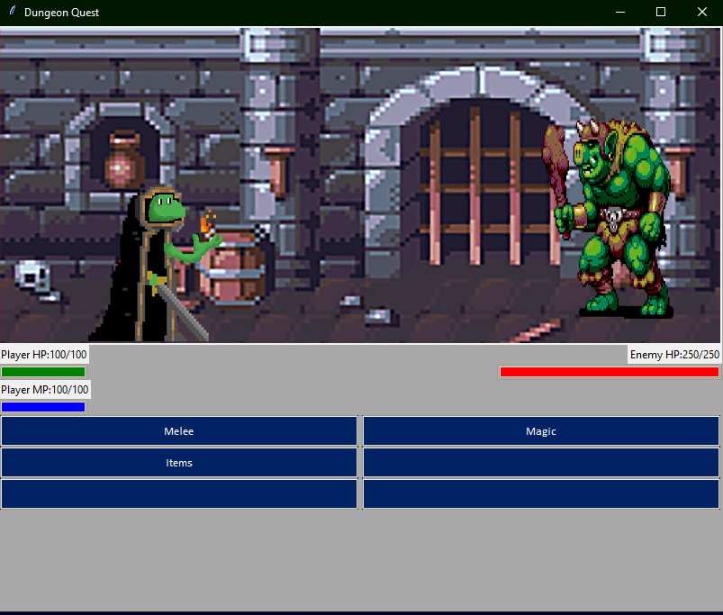
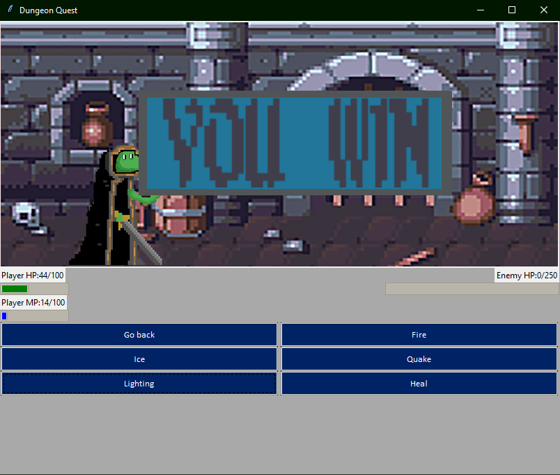
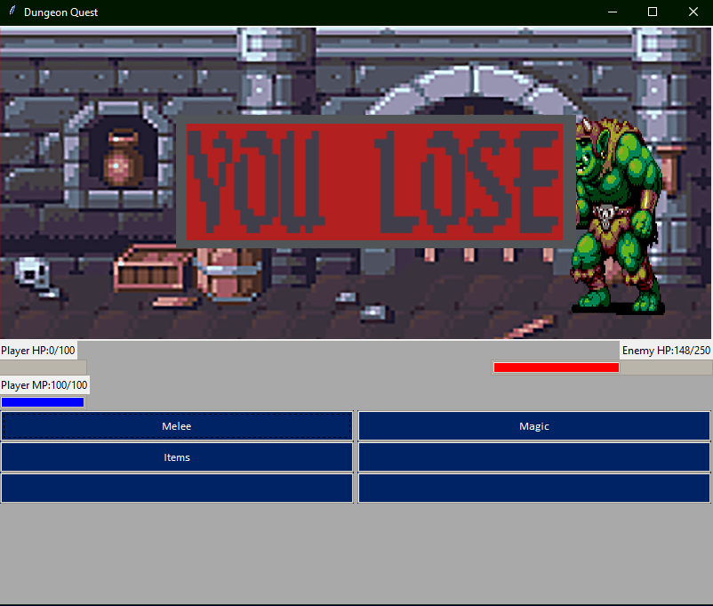

# Simple RPG Game

A little rpg game with both GUI and UI options

Screenshots:

Possible Ideas:
- Add main menu
- Singles player & vs mode
  - Vs mode turn based with 2 tkinter frames
- Character select
- Co-op
