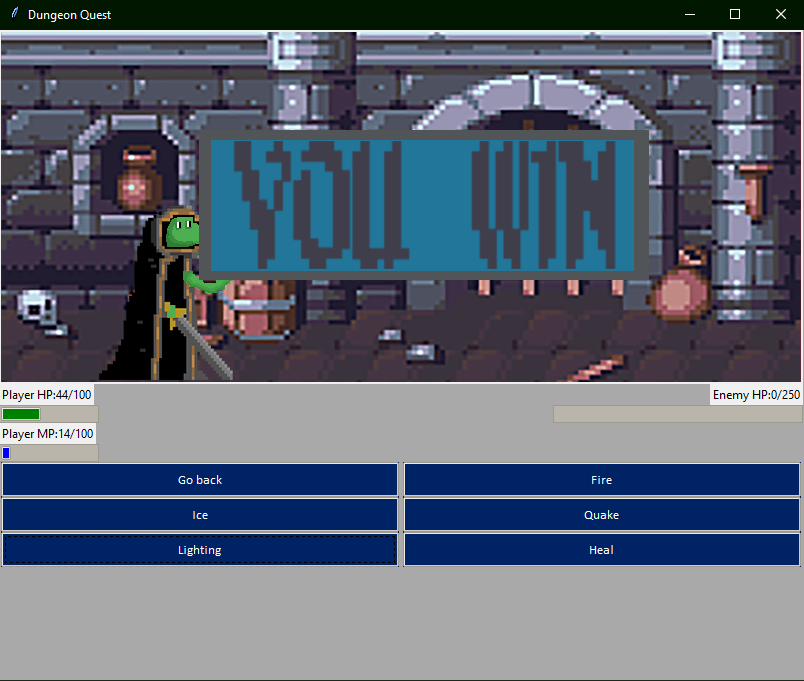
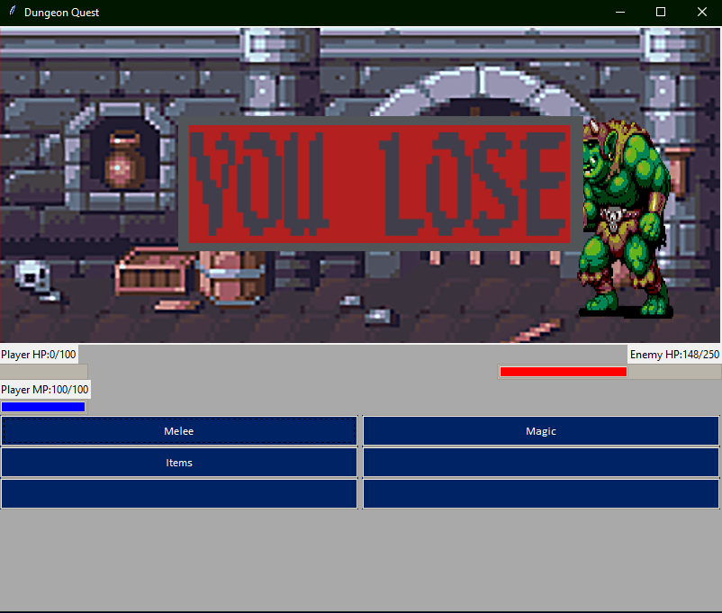

# Simple RPG Game

## Other Docs

[Program Documentation](docs/documentation.md)

---

A little rpg game with both GUI and UI options

---
## Screenshots:

---
## Possible Ideas:
- Add main menu
- Singles player & vs mode
  - Vs mode turn based with 2 tkinter frames
- Character select
- Co-op
