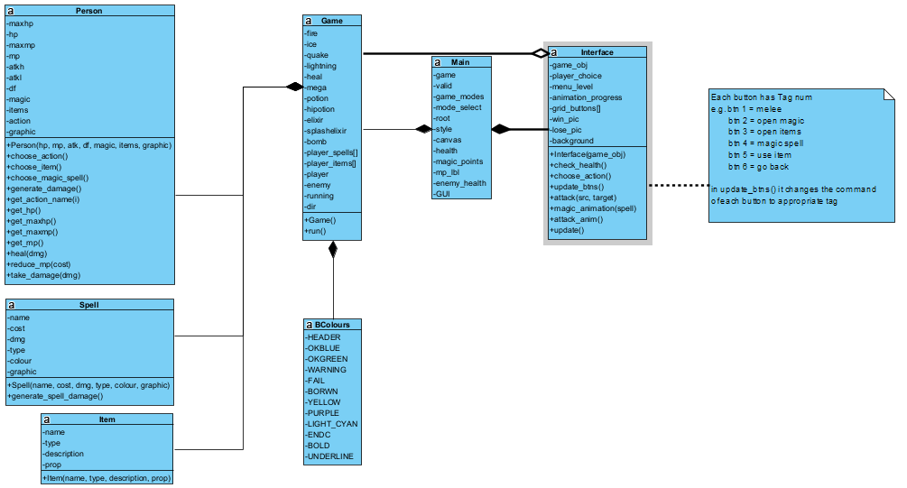

# Documentation W.I.P

## Contents
---
- Program Flow
- Current Class Diagram
- Restructured Class Diagram

### Overview
---

This should've been done before development but I didn't know better years ago 

### Program Flow:
---

### Current Class Diagram:
---

### Restructured Class Diagram:
---
This Diagram shows how the program should work after the restructure, it is very similar to the one above however, they key differences are that the non-gui can run entirely seperate to main, and the some of the bulk of the classes has been reduced.

This restructure was done to better seperate the non-gui from the gui this way the gui can be seen as an extension to the game instead of it's own game.

